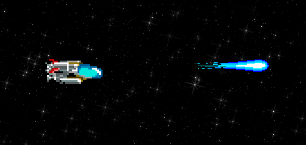
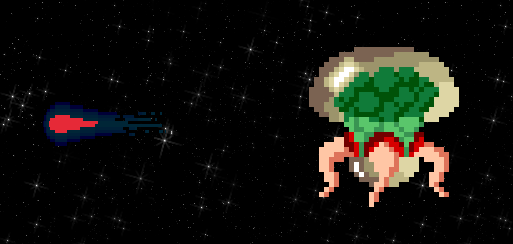

# R-Type [EPITECH]

<a href="https://img.shields.io/badge/MADE%20WITH-RAYLIB-brightgreen" alt="Raylib">
        </a>
<a href="https://img.shields.io/badge/MADE%20WITH-C%2B%2B-ff69b4" alt="C++">
        </a>
<a href="https://img.shields.io/badge/MADE%20WITH-VCPKG-blueviolet" alt="vcpkg">
        </a>
<a href="https://img.shields.io/badge/MADE%20WITH-CMAKE-red" alt="Cmake">
        </a>




> The goal of this Advanced C++ project, R-Type will present the development of network video games. Implement of a multi-threaded server and a graphical client, using a reusable game engine of our own design. The purpose of this project is to create a multiplayer game, using a client/srver architecture.

## Documentation

You can find the full project documentation on [this link](https://andreahosotte.github.io/epitech-r-type-documentation/).

## Installation

**Linux:**
Open a terminal window. Navigate to the project directory and run the following commands:
```sh
git clone https://github.com/Microsoft/vcpkg.git
./vcpkg/bootstrap-vcpkg.sh
./vcpkg/vcpkg install asio raylib boost-asio boost-serialization boost-filesystem
mkdir build && cd build && cmake ..
make
```

**Windows:**
* Install vcpkg (if not already installed) from the Vcpkg Github releases page. Run the installer and follow the installation instructions.

Open a command prompt or PowerShell window. Navigate to the project directory and run the following commands:
```sh
vcpkg install asio raylib boost-asio boost-serialization boost-filesystem
mkdir build
cd build
cmake .. -DCMAKE_TOOLCHAIN_FILE=C:/path/to/vcpkg/scripts/buildsystems/vcpkg.cmake
cmake --build .
```
**Make sure to replace `C:/path/to/vcpkg/` with the actual path to your vcpkg installation directory !**

After these steps, you should have two binaries in the `build/` directory : `r-type_server` and `r-type_client`

## Usage example

**In terminal**

```sh
./r-type_server
```

**In another terminal**

```sh
./r-type_client
```

## Git

### Branch management

In order to work properly with git, here are the best practices we followed:

* Push on the dev branch for minimalist features, or create a new branch for bigger parts.
* Make commits for any logical modification.
* Follow the `commit style` _(see below)_.
* Complete the documentation with the feature you added.
* Make some tests and code review before any merge.


### Commit style

In order to keep things organized, here is the commit style we used:

* Each commit have to be in english.
* Each commit must start with a square bracket enclosed key. Those keys can be found among those:
    * [ADD] -- if you add features, files and so on,
    * [DEL] -- if you delete features, files,
    * [FIX] -- if you corrected a bug or any form of default,
    * [MERGE] -- if you merge a branch with an other
* Each commit must be followed by a line explaining basics of the changes.

### More

Here is an exemple of a GeometryDash-like game created with the help of our engine:


https://github.com/TheoFaupin/GeometryDash
**(This repository is currently private but will soon be public)**
## Authors

* **Hippolyte Aubert** - [@hippolyte-aubert](https://github.com/hippolyte-aubert)
* **Nils Colire** - [@Nils-1337](https://github.com/Nils-1337)
* **Theo Faupin** - [@TheoFaupin](https://github.com/TheoFaupin)
* **Andrea Hosotte** - [@AndreaHosotte](https://github.com/AndreaHosotte)
* **Romain Very** - [@RomaiinVery](https://github.com/RomaiinVery)
